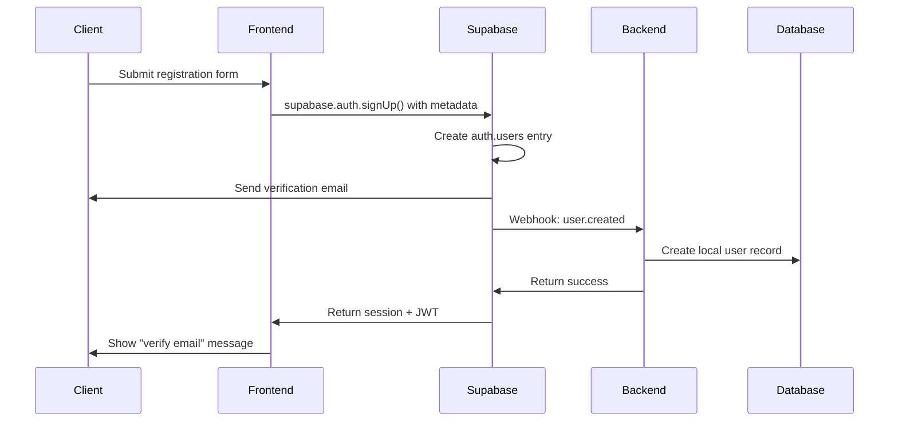
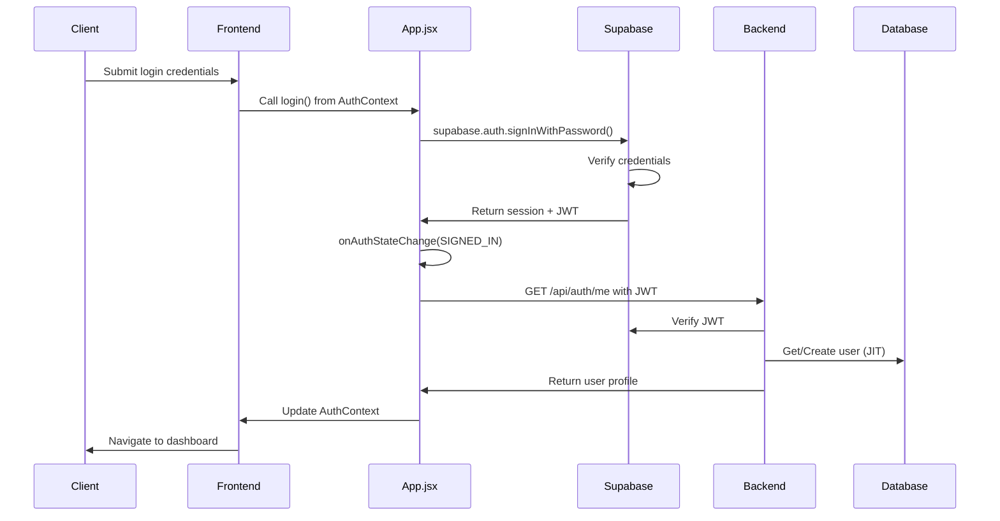
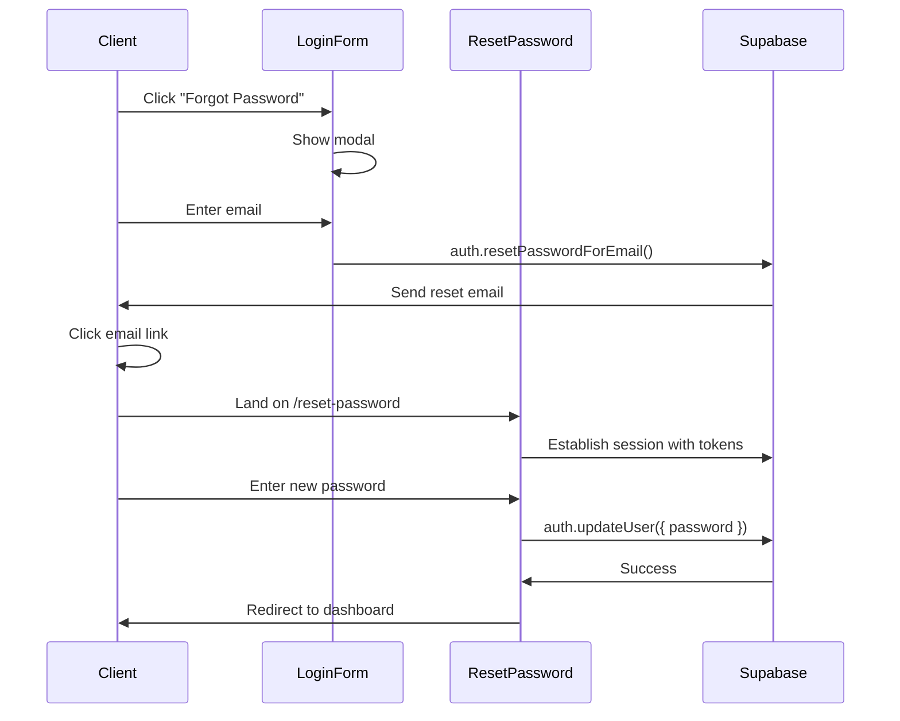

# Authentication API Documentation

## Overview

The Brikli Authentication API provides secure user authentication and authorization using JWT tokens via Supabase Auth. This module handles user registration, login, profile management, password operations, and session management.

## Current Implementation Status

### What's Implemented ✅
- Email/password authentication via Supabase
- Google OAuth integration
- JWT token validation and management
- User profile management
- Avatar upload functionality
- Password reset flow
- Just-In-Time (JIT) user provisioning
- Webhook-based user synchronization
- Protected route enforcement

### What's Missing or Incomplete ⚠️
- Email verification endpoint (`/api/auth/resend-verification`)
- Password verification endpoint (for secure password changes)
- Session management endpoints (logout, session listing)
- Email verification status tracking
- Proper reauthentication flow for sensitive operations

## Architecture

### Technology Stack
- **Authentication Provider**: Supabase Auth
- **Token Type**: JWT (JSON Web Tokens)
- **Token Storage**: localStorage (frontend)
- **Database**: PostgreSQL with SQLModel ORM
- **Password Hashing**: Handled by Supabase (bcrypt)
- **File Storage**: Azure Blob Storage (for avatars)
- **Frontend Framework**: React with Context API
- **HTTP Client**: Axios for API calls

### Design Principles
- **Stateless Authentication**: JWT tokens contain all necessary claims
- **Single Source of Truth**: Supabase manages authentication state
- **Just-In-Time Provisioning**: Users are created in local DB on first access
- **Role-Based Access Control**: User types determine permissions (currently only LANDLORD)
- **Security First**: All endpoints require authentication unless specified

### Component Overview
```
Frontend Components:
├── App.jsx                    # Main auth state management
├── contexts/AuthContext.js    # Auth context definition
├── supabaseClient.js         # Supabase client configuration
├── components/
│   ├── LoginForm.jsx         # Email/password login
│   ├── RegisterForm.jsx      # User registration
│   └── GoogleSignInButton.jsx # OAuth login
├── pages/
│   └── ResetPassword.jsx     # Password reset handling
└── utils/api/
    └── auth.js               # Backend API calls

Backend Components:
└── api/auth.py               # All auth endpoints (to be refactored)

## Authentication Flow

### 1. User Registration


**Current Implementation:**
- `RegisterForm.jsx` collects: email, password, first name, last name, phone
- Password requirements enforced client-side
- Metadata passed to Supabase for webhook processing
- Shows success message but no automatic login until email verified

### 2. User Login


**Current Implementation:**
- `LoginForm.jsx` uses `login()` function from AuthContext
- JWT stored in localStorage as "token"
- User profile fetched and cached in localStorage
- Automatic redirect to dashboard on success
- Google OAuth follows same flow after redirect

### 3. Password Reset


**Current Implementation:**
- `LoginForm.jsx` has forgot password modal
- `ResetPassword.jsx` handles token parsing from URL hash
- Automatic session establishment with recovery tokens
- Redirects to dashboard after successful reset

## API Endpoints

### Currently Implemented Endpoints ✅

#### Get Current User
```http
GET /api/auth/me
Authorization: Bearer <token>
```

**Response:**
```json
{
  "id": "123e4567-e89b-12d3-a456-426614174000",
  "email": "user@example.com",
  "first_name": "John",
  "last_name": "Doe",
  "user_type": "LANDLORD",
  "phone": "1234567890",
  "address": "123 Main St",
  "city": "Toronto",
  "province": "ON",
  "postal_code": "M1M 1M1",
  "profile_image_url": "https://storage.blob.core.windows.net/avatars/123.jpg",
  "created_at": "2024-01-01T00:00:00Z",
  "updated_at": "2024-01-01T00:00:00Z",
  "is_active": true,
  "is_admin": false,
  "is_email_verified": true
}
```

**Implementation Notes:**
- Used by App.jsx on login and session restore
- Performs JIT user creation if user not in local DB
- Validates JWT with Supabase before proceeding

#### Resend Email Verification ✅
```http
POST /api/auth/resend-verification
Content-Type: application/json

{
  "email": "user@example.com"
}
```

**Response:**
```json
{
  "success": true,
  "message": "If an account exists with this email, a verification email has been sent."
}
```

**Implementation Details:**
- No authentication required (unverified users can't log in)
- Uses Supabase's resend API
- Returns generic message for security (prevents email enumeration)
- Handles rate limiting (429 responses)
- Properly handles GoTrueApiError exceptions

### Password Management

#### Verify Password
```http
POST /api/auth/verify-password
Authorization: Bearer <token>
Content-Type: application/json

{
  "password": "current_password"
}
```

**Response:**
```json
{
  "success": true,
  "message": "Password verified"
}
```

**Purpose:** Verify current password without creating new session (used by SecurityForm.jsx)

**Error Responses:**
- `401`: Invalid password
- `422`: Validation error (missing password)

#### Change Password
```http
POST /api/auth/change-password
Authorization: Bearer <token>
Content-Type: application/json

{
  "current_password": "old_password",
  "new_password": "new_secure_password"
}
```

**Response:**
```json
{
  "success": true,
  "message": "Password changed successfully"
}
```

**Password Requirements:**
- Minimum 8 characters
- At least one uppercase letter
- At least one lowercase letter
- At least one number
- At least one special character (!@#$%^&*()_+-=[]{}|;:,.<>?)
- Must be different from current password

**Error Responses:**
- `401`: Current password is incorrect
- `422`: Validation error (weak password, same as current, etc.)
- `400`: Password change failed (Supabase error)

### Profile Management

#### Update User Profile
```http
PUT /api/auth/users/{user_id}/profile
Authorization: Bearer <token>
Content-Type: application/json

{
  "first_name": "John",
  "last_name": "Doe",
  "phone": "1234567890",
  "address": "123 Main St",
  "city": "Toronto",
  "province": "ON",
  "postal_code": "M1M 1M1"
}
```

**Response:** Updated user object

#### Upload Avatar
```http
POST /api/auth/users/{user_id}/avatar
Authorization: Bearer <token>
Content-Type: multipart/form-data

file: <image_file>
```

**Response:**
```json
{
  "profile_image_url": "https://storage.blob.core.windows.net/avatars/123-avatar.jpg"
}
```

### Email Verification

#### Request Email Verification
```http
POST /api/auth/request-email-verification
Authorization: Bearer <token>
```

**Response:**
```json
{
  "message": "Verification email sent"
}
```

#### Verify Email
```http
POST /api/auth/verify-email/{token}
```

**Response:**
```json
{
  "message": "Email verified successfully"
}
```

### Session Management

#### Logout
```http
POST /api/auth/logout
Authorization: Bearer <token>
```

**Response:**
```json
{
  "message": "Logged out successfully"
}
```

#### List Active Sessions
```http
GET /api/auth/sessions
Authorization: Bearer <token>
```

**Response:**
```json
{
  "sessions": [
    {
      "id": "session_123",
      "device": "Chrome on Windows",
      "ip_address": "192.168.1.1",
      "created_at": "2024-01-01T00:00:00Z",
      "last_active": "2024-01-01T12:00:00Z"
    }
  ]
}
```

#### Revoke Session
```http
DELETE /api/auth/sessions/{session_id}
Authorization: Bearer <token>
```

**Response:**
```json
{
  "message": "Session revoked"
}
```

### Webhook Endpoints

#### Supabase User Sync Webhook
```http
POST /api/auth/webhook/user-sync
X-Webhook-Secret: <webhook_secret>
Content-Type: application/json

{
  "type": "INSERT",
  "table": "users",
  "schema": "auth",
  "record": {
    "id": "123e4567-e89b-12d3-a456-426614174000",
    "email": "user@example.com",
    "raw_user_meta_data": {
      "first_name": "John",
      "last_name": "Doe",
      "phone": "1234567890"
    }
  }
}
```

**Response:**
```json
{
  "message": "User created successfully"
}
```

#### Manual User Sync
```http
POST /api/auth/sync-user
X-Webhook-Secret: <webhook_secret>
Content-Type: application/json

{
  "supabase_user_id": "123e4567-e89b-12d3-a456-426614174000",
  "email": "user@example.com",
  "first_name": "John",
  "last_name": "Doe",
  "phone": "1234567890",
  "user_type": "LANDLORD"
}
```

**Response:** User object

## Data Models

### User Model
```python
class User(SQLModel, table=True):
    __tablename__ = "users"
    
    id: UUID = Field(primary_key=True)
    email: str = Field(unique=True, index=True)
    first_name: str | None = None
    last_name: str | None = None
    user_type: UserType = Field(default=UserType.LANDLORD)
    phone: str | None = None
    address: str | None = None
    city: str | None = None
    province: str | None = None
    postal_code: str | None = None
    profile_image_url: str | None = None
    created_at: datetime
    updated_at: datetime
    is_active: bool = Field(default=True)
    is_admin: bool = Field(default=False)
    is_email_verified: bool = Field(default=False)
```

### User Types
```python
class UserType(str, Enum):
    LANDLORD = "LANDLORD"
    TENANT = "TENANT"
    ADMIN = "ADMIN"
```

## Security

### Authentication Requirements
- All endpoints require valid JWT token unless specified
- Tokens are validated against Supabase
- Tokens expire after 1 hour (configurable)
- Refresh tokens are handled by frontend

### Authorization Rules
1. **Users can only access their own data** (except admins)
2. **Admins have full access** to all user data
3. **Webhook endpoints** require webhook secret
4. **Password operations** require current password verification

### Rate Limiting
- Login attempts: 5 per minute per IP
- Password reset: 3 per hour per email
- Registration: 10 per hour per IP
- API calls: 100 per minute per user

### Security Headers
```python
X-Content-Type-Options: nosniff
X-Frame-Options: DENY
X-XSS-Protection: 1; mode=block
Strict-Transport-Security: max-age=31536000; includeSubDomains
```

## Error Handling

### Error Response Format
```json
{
  "detail": "Error message",
  "status_code": 400,
  "error_code": "INVALID_PASSWORD"
}
```

### Common Error Codes
| Code | HTTP Status | Description |
|------|-------------|-------------|
| `INVALID_CREDENTIALS` | 401 | Invalid email or password |
| `UNAUTHORIZED` | 401 | Missing or invalid token |
| `FORBIDDEN` | 403 | Insufficient permissions |
| `USER_NOT_FOUND` | 404 | User does not exist (Note: Some endpoints return generic messages for security) |
| `INVALID_PASSWORD` | 400 | Password doesn't meet requirements |
| `EMAIL_NOT_VERIFIED` | 403 | Email verification required |
| `RATE_LIMIT_EXCEEDED` | 429 | Too many requests (commonly from email resend endpoints) |
| `VALIDATION_ERROR` | 422 | Request body validation failed |

## Best Practices

### Frontend Integration
1. **Store tokens securely** (httpOnly cookies or secure storage)
2. **Refresh tokens proactively** before expiration
3. **Handle 401 errors** by redirecting to login
4. **Validate input** before sending to backend

### Password Requirements
- Minimum 8 characters
- At least one uppercase letter
- At least one lowercase letter
- At least one number
- At least one special character

### Session Management
1. **Logout on all devices** when password changes
2. **Monitor suspicious activity** (multiple locations)
3. **Implement "Remember Me"** with longer refresh tokens
4. **Clear tokens** on logout

## Testing

### Test Coverage

The authentication module has comprehensive test coverage at multiple levels:

#### Unit Tests
Located in `Backend/tests/unit_tests/auth/test_service.py`

- **Service Layer Tests**: Pure unit tests for AuthService methods
  - `TestGetUserById`: Tests user retrieval logic
  - `TestCreateUserFromSupabase`: Tests user creation with deduplication
  - `TestVerifyUserPassword`: Tests password verification without sessions
  - `TestChangeUserPassword`: Tests password change workflow
  - `TestUpdateUserProfile`: Tests profile update logic
  - `TestResendVerificationEmail`: Tests email verification resend
  - `TestUploadUserAvatar`: Tests avatar upload process
  - `TestRequestEmailVerification`: Tests verification requests
  - `TestHandleWebhookUserSync`: Tests webhook processing

#### API Tests
Located in `Backend/tests/api_tests/auth/`

- **test_auth_get.py**: Tests for GET endpoints (8 test cases)
  - `/api/auth/me` endpoint coverage
- **test_auth_post.py**: Tests for POST endpoints (12 test cases)
  - Avatar upload, webhooks, user sync, email verification
- **test_auth_put.py**: Tests for PUT endpoints (9 test cases)
  - Profile update functionality

### Test User Credentials
```json
{
  "email": "test@example.com",
  "password": "TestPassword123!"
}
```

### Testing Authentication
```python
# Get test token
async def get_test_token():
    supabase = get_supabase_client()
    response = supabase.auth.sign_in_with_password({
        "email": "test@example.com",
        "password": "TestPassword123!"
    })
    return response.session.access_token

# Use in tests
headers = {"Authorization": f"Bearer {token}"}
response = await client.get("/api/auth/me", headers=headers)
```

### Running Tests

```bash
# Run all auth unit tests
cd Backend/tests
python -m pytest unit_tests/auth/ -v

# Run all auth API tests  
cd Backend/tests
python -m pytest api_tests/auth/ -v

# Run specific test class
python -m pytest unit_tests/auth/test_service.py::TestVerifyUserPassword -v
```

## Migration Guide

### From Old auth.py to New Module
1. Update imports:
   ```python
   # Old
   from Backend.api.auth import get_current_user
   
   # New
   from Backend.api.auth.dependencies import get_current_user
   ```

2. Update endpoint paths (no changes needed)

3. New features available:
   - Password verification before sensitive operations
   - Email verification flow
   - Session management
   - Enhanced security

## Troubleshooting

### Common Issues

#### "Invalid authentication credentials"
- Token expired: Refresh token via Supabase
- Token malformed: Check Authorization header format
- User not synced: Check webhook logs

#### "User not found in local database"
- JIT provisioning failed: Check database connection
- Webhook didn't fire: Verify webhook configuration
- Race condition: Retry request

#### "Password change failed"
- Current password incorrect: Verify with user
- New password invalid: Check requirements
- Supabase error: Check Supabase logs

### Debug Logging
```python
import logging
logging.getLogger("Backend.api.auth").setLevel(logging.DEBUG)
```

## Frontend Authentication State Management

### AuthContext Implementation (App.jsx)

The authentication state is managed centrally in `App.jsx` and provided via AuthContext:

```javascript
const authValue = {
  user,              // User object from backend
  setUser,           // Update user state
  login,             // Login function
  logout,            // Logout function  
  isAuthenticated    // Boolean flag
};
```

### Key Functions:

#### Login Function
```javascript
const login = async (email, password) => {
  const { data, error } = await supabase.auth.signInWithPassword({
    email,
    password,
  });
  
  if (error) throw error;
  
  // Token stored automatically by Supabase
  // User profile fetched via onAuthStateChange listener
  return data;
};
```

#### Logout Function
```javascript
const logout = async () => {
  await supabase.auth.signOut();
  localStorage.removeItem("user");
  localStorage.removeItem("token");
  setUser(null);
};
```

### Session Persistence
- JWT token stored in localStorage as "token"
- User profile cached in localStorage as "user"
- Session restored on app load via `supabase.auth.getSession()`
- 10-second timeout prevents infinite loading states

### Auth State Change Handling
```javascript
supabase.auth.onAuthStateChange(async (event, session) => {
  switch(event) {
    case 'SIGNED_IN':
      // Fetch user profile from backend
      // Store token and user in localStorage
      break;
    case 'SIGNED_OUT':
      // Clear localStorage and state
      break;
    case 'TOKEN_REFRESHED':
      // Token auto-refreshed by Supabase
      break;
  }
});
```

## OAuth Integration

### Currently Supported Providers

#### Google OAuth ✅
Google Sign-In is fully implemented through Supabase OAuth integration.

**Frontend Implementation:**
- Component: `GoogleSignInButton.jsx`
- Used in: `LoginForm.jsx` and `RegisterForm.jsx`
- Styling: Material Design with proper Google branding
- Error handling: Shows user-friendly error messages

**Flow:**
1. User clicks "Continue with Google" button
2. `supabase.auth.signInWithOAuth({ provider: "google" })` called
3. Redirects to Google consent screen
4. Google redirects back to Supabase callback URL
5. Supabase creates/updates user and issues JWT
6. App receives SIGNED_IN event and fetches user profile
7. User redirected to dashboard

**Configuration:**
- Set up in Supabase Dashboard under Authentication → Providers
- Redirect URLs configured in Supabase
- No additional backend endpoints required
- JIT user creation handles first-time OAuth users

## Future Enhancements

### Planned Features
1. **Two-Factor Authentication (2FA)**
   - TOTP support
   - SMS verification
   - Backup codes

2. **Additional OAuth Providers**
   - Microsoft OAuth
   - Facebook OAuth
   - Apple Sign In
   - LinkedIn OAuth

3. **Advanced Security**
   - Device fingerprinting
   - Anomaly detection
   - IP allowlisting

4. **Audit Trail**
   - Login history
   - Password change history
   - Permission changes

---

*Last Updated: 2025-06-28*
*Version: 1.0*